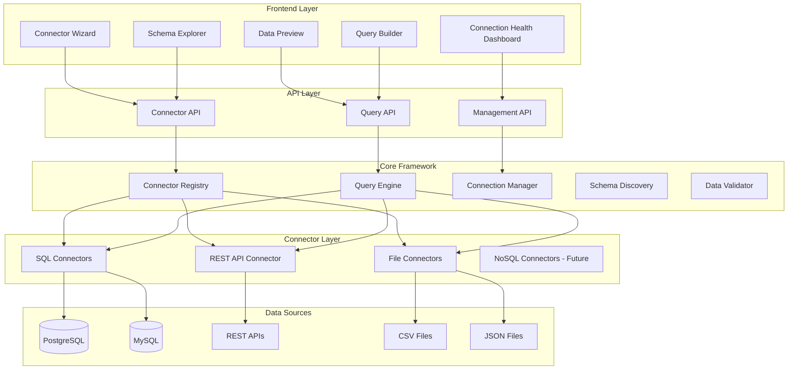
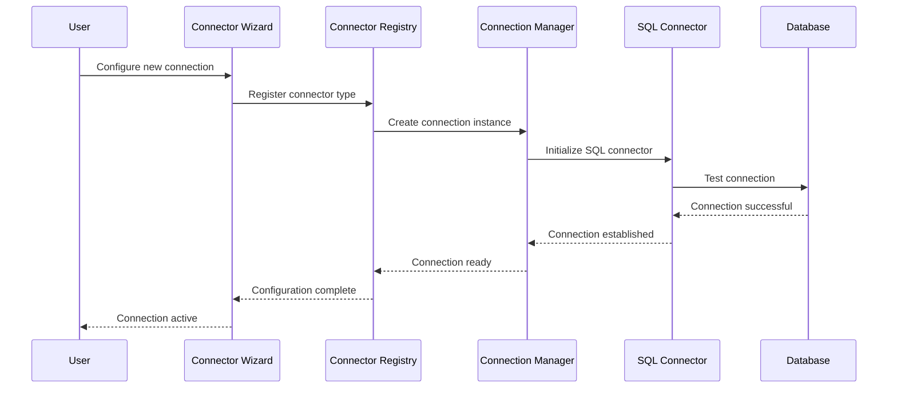
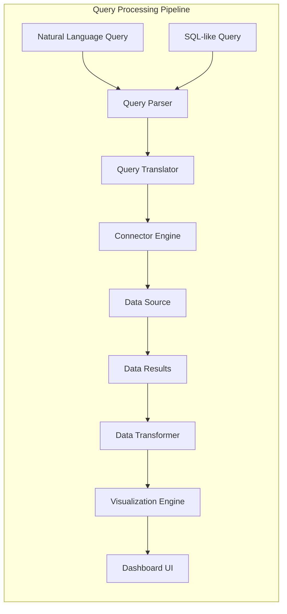
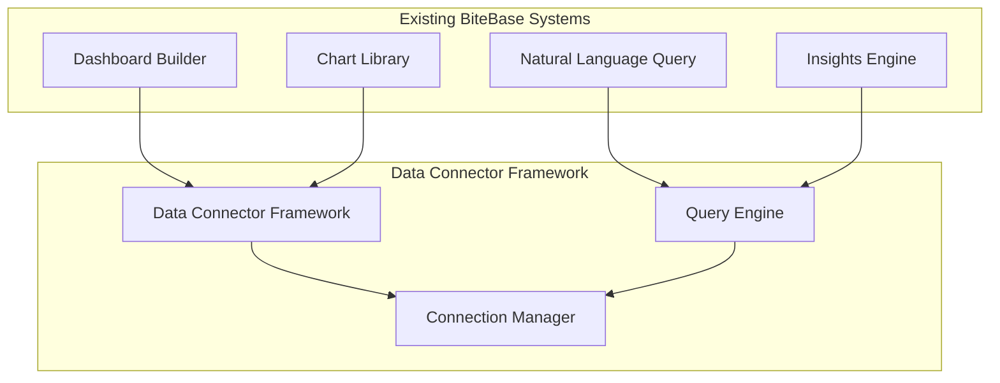

# Advanced Data Connector Framework Architecture
## BiteBase BI Platform - Wave 4 Enhancement

### Executive Summary

The Advanced Data Connector Framework is designed to provide universal connectivity to 20+ data source types, enabling comprehensive business intelligence through a unified interface. This architecture integrates seamlessly with the existing BiteBase BI platform's advanced chart library, natural language query interface, and automated insights engine.

### High-Level System Architecture



### Connector Architecture Flow



### Query Processing Flow



## Core Architectural Components

### 1. Universal Connector Interface

```typescript
interface BaseConnector {
  id: string
  type: ConnectorType
  name: string
  config: ConnectorConfig
  
  // Core operations
  connect(): Promise<ConnectionResult>
  disconnect(): Promise<void>
  testConnection(): Promise<TestResult>
  
  // Schema operations
  discoverSchema(): Promise<SchemaInfo>
  getTableList(): Promise<TableInfo[]>
  getColumnInfo(table: string): Promise<ColumnInfo[]>
  
  // Query operations
  executeQuery(query: UniversalQuery): Promise<QueryResult>
  previewData(query: UniversalQuery, limit: number): Promise<PreviewResult>
  
  // Health monitoring
  getHealthStatus(): Promise<HealthStatus>
  getMetrics(): Promise<ConnectorMetrics>
}
```

### 2. Query Abstraction Layer

The framework uses a SQL-like syntax that translates to native queries:

```sql
-- Universal SQL-like syntax that translates to native queries
SELECT customer_count, revenue, location 
FROM sales_data 
WHERE date_range = 'last_30_days' 
GROUP BY location 
ORDER BY revenue DESC 
LIMIT 10
```

This translates to:
- **PostgreSQL**: Native SQL
- **REST API**: HTTP requests with query parameters
- **CSV**: Pandas-like operations
- **MongoDB**: Aggregation pipeline

### 3. Connection Management System

**Features:**
- **Connection Pooling**: Efficient resource utilization with configurable pool sizes
- **Health Monitoring**: Real-time status tracking with automatic failover
- **Credential Security**: AES-256 encrypted storage with role-based access control
- **Lifecycle Management**: Automatic connection cleanup and renewal

### 4. Schema Discovery Service

**Capabilities:**
- **Automatic Detection**: Discover tables, columns, data types, and relationships
- **Metadata Extraction**: Primary keys, foreign keys, indexes, constraints
- **Data Profiling**: Sample data analysis, null counts, unique values
- **Relationship Mapping**: Automatic foreign key detection and relationship inference

### 5. Data Preview and Validation System

**Features:**
- **Safe Sampling**: Preview data without full table scans
- **Data Quality Checks**: Validate data integrity and format consistency
- **Performance Estimation**: Query cost analysis before execution
- **Security Validation**: Ensure queries don't expose sensitive data

## Integration Points with Existing Systems



### Integration Specifications

1. **Natural Language Query Integration**
   - Extend existing NL processor to support external data sources
   - Add data source context to entity extraction
   - Enable cross-source query capabilities

2. **Dashboard Builder Integration**
   - Add data source selection to widget configuration
   - Enable real-time data refresh from external sources
   - Support mixed-source dashboards

3. **Chart Library Integration**
   - Automatic chart type suggestions based on external data structure
   - Support for large datasets with pagination and streaming
   - Cross-filtering capabilities across different data sources

4. **Insights Engine Integration**
   - Extend anomaly detection to external data sources
   - Enable pattern analysis across multiple data sources
   - Support for real-time insights from streaming data

## Implementation Phases

### Phase 1: Core Foundation
**Duration**: 3-4 weeks
**Deliverables**:
- Core connector architecture design
- Universal query abstraction layer
- Connection management system
- Schema discovery mechanism
- Data preview and validation system
- Connector configuration interface

### Phase 2: Basic Connectors
**Duration**: 4-5 weeks
**Deliverables**:
- Base connector interface implementation
- SQL database connectors (PostgreSQL, MySQL, SQLite)
- REST API connector with authentication
- CSV/JSON file format connectors

### Phase 3: Advanced Features
**Duration**: 4-5 weeks
**Deliverables**:
- Credential management with encryption
- Query translation engine
- Connection pooling and lifecycle management
- Schema discovery service
- Data preview system
- Health monitoring and alerting

### Phase 4: Frontend Interface
**Duration**: 3-4 weeks
**Deliverables**:
- Connector wizard with step-by-step setup
- Schema explorer with visual display
- Data preview interface
- Connection health dashboard
- Query builder for non-technical users

### Phase 5: API & Integration
**Duration**: 3-4 weeks
**Deliverables**:
- Connector management API endpoints
- Data source testing and validation APIs
- Connector registry and discovery APIs
- Integration points with existing systems

### Phase 6: Optimization & Testing
**Duration**: 2-3 weeks
**Deliverables**:
- Performance optimization and caching
- Comprehensive error handling
- Logging and audit trail system
- Documentation and help system
- Complete test suite

## Technical Specifications

### Performance Requirements
- **Connection Establishment**: <2s for SQL databases, <3s for REST APIs
- **Schema Discovery**: <5s for typical databases
- **Data Preview**: <3s for sample queries (1000 rows max)
- **Query Translation**: <100ms for standard queries
- **Connection Pooling**: Support 50+ concurrent connections per connector type

### Security Features
- **Credential Encryption**: AES-256 encryption for stored credentials
- **Connection Validation**: SQL injection prevention and input sanitization
- **Access Control**: Role-based permissions for data source access
- **Audit Logging**: Complete trail of all data access and modifications

### Scalability Design
- **Horizontal Scaling**: Support for multiple connector instances
- **Caching Strategy**: Query result caching with TTL-based invalidation
- **Resource Management**: Automatic connection cleanup and memory management
- **Load Balancing**: Distribute queries across multiple connector instances

## Data Source Support Matrix

### Phase 1 (Initial Implementation)
| Data Source | Priority | Complexity | Features |
|-------------|----------|------------|----------|
| PostgreSQL | High | Medium | Full SQL support, schema discovery, connection pooling |
| MySQL | High | Medium | Full SQL support, schema discovery, connection pooling |
| SQLite | High | Low | Local file support, schema discovery |
| REST APIs | High | High | Authentication, pagination, rate limiting |
| CSV Files | Medium | Low | Local/remote files, automatic schema detection |
| JSON Files | Medium | Low | Nested data support, schema inference |

### Phase 2 (Future Expansion)
| Data Source | Priority | Complexity | Features |
|-------------|----------|------------|----------|
| MongoDB | Medium | High | Document queries, aggregation pipeline |
| Redis | Medium | Medium | Key-value operations, pub/sub |
| Elasticsearch | Medium | High | Full-text search, aggregations |
| GraphQL | Low | High | Schema introspection, query optimization |
| Parquet | Low | Medium | Columnar data, compression |
| Excel | Low | Medium | Multiple sheets, formula support |

## File Structure

```
backend/app/services/connectors/
├── __init__.py
├── base/
│   ├── __init__.py
│   ├── connector.py          # BaseConnector interface
│   ├── query.py             # Universal query types
│   └── exceptions.py        # Connector exceptions
├── registry/
│   ├── __init__.py
│   ├── connector_registry.py
│   └── discovery.py
├── sql/
│   ├── __init__.py
│   ├── postgresql.py
│   ├── mysql.py
│   └── sqlite.py
├── api/
│   ├── __init__.py
│   └── rest_connector.py
├── file/
│   ├── __init__.py
│   ├── csv_connector.py
│   └── json_connector.py
├── management/
│   ├── __init__.py
│   ├── connection_manager.py
│   ├── health_monitor.py
│   └── credential_manager.py
└── query/
    ├── __init__.py
    ├── translator.py
    ├── optimizer.py
    └── executor.py

frontend/src/components/connectors/
├── index.ts
├── ConnectorWizard.tsx
├── SchemaExplorer.tsx
├── DataPreview.tsx
├── ConnectionHealth.tsx
├── QueryBuilder.tsx
├── types/
│   ├── connectorTypes.ts
│   └── queryTypes.ts
├── hooks/
│   ├── useConnector.ts
│   ├── useSchema.ts
│   └── useDataPreview.ts
└── components/
    ├── ConnectorCard.tsx
    ├── ConnectionForm.tsx
    ├── SchemaTree.tsx
    └── QueryEditor.tsx
```

## Success Metrics

### Technical Metrics
- **Connection Success Rate**: >99% for stable data sources
- **Query Performance**: <3s for typical queries
- **Schema Discovery Time**: <5s for standard databases
- **System Uptime**: >99.9% availability
- **Error Rate**: <1% for established connections

### Business Metrics
- **Data Source Coverage**: Support for 20+ data source types
- **User Adoption**: 80% of users connect at least one external data source
- **Query Volume**: Handle 10,000+ queries per day
- **Dashboard Integration**: 50% of dashboards use external data sources
- **Time to Value**: Users can connect and visualize data within 10 minutes

This architecture provides a robust, scalable foundation for the Advanced Data Connector Framework while maintaining seamless integration with the existing BiteBase BI platform infrastructure.