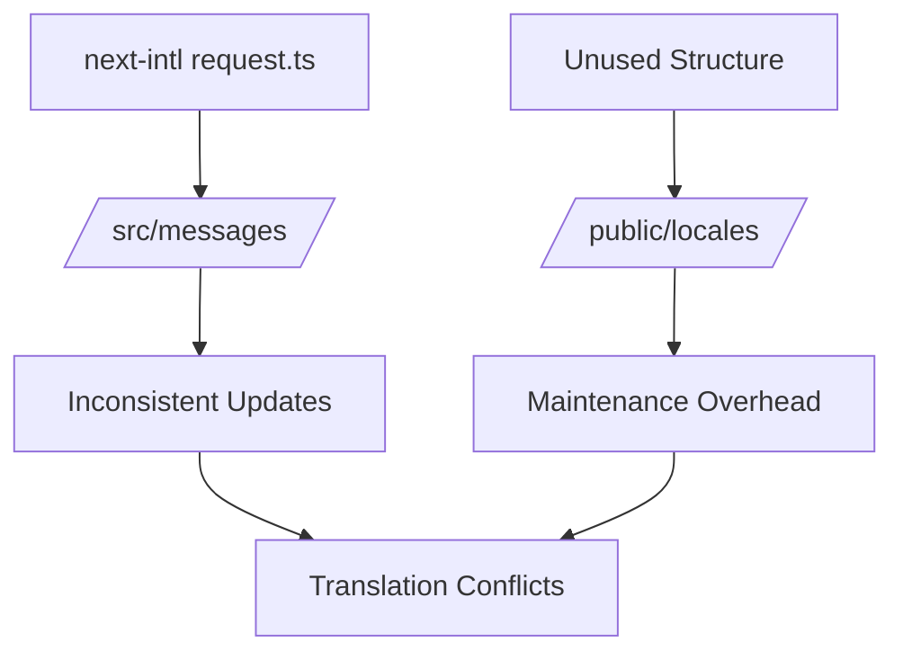
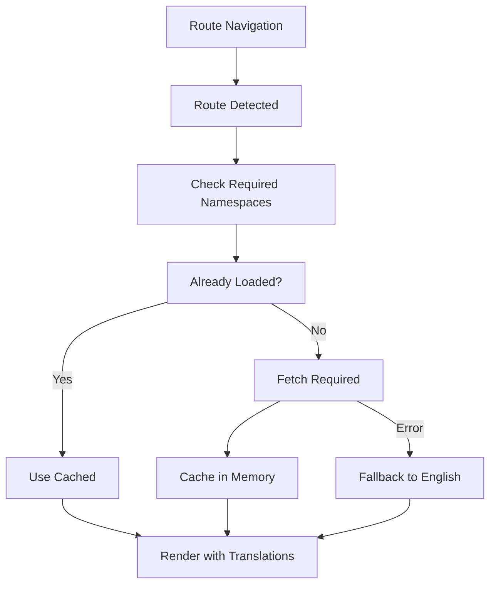
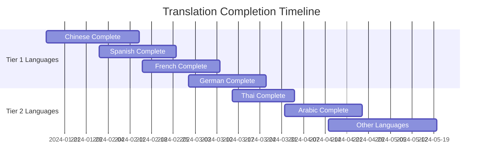
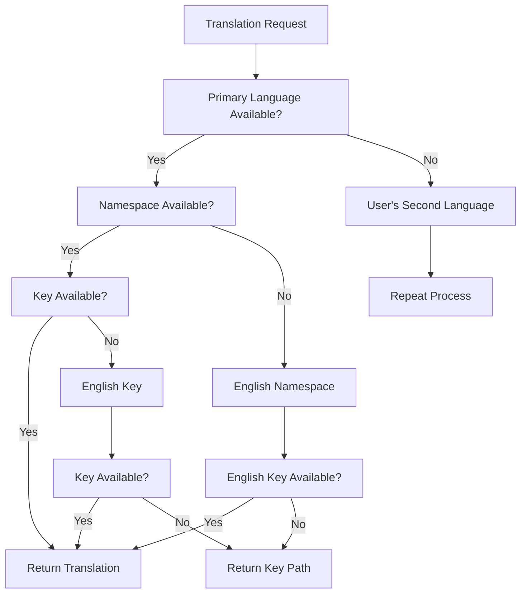
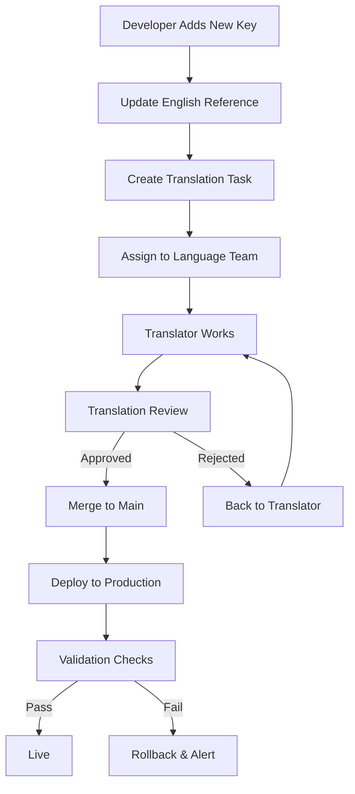
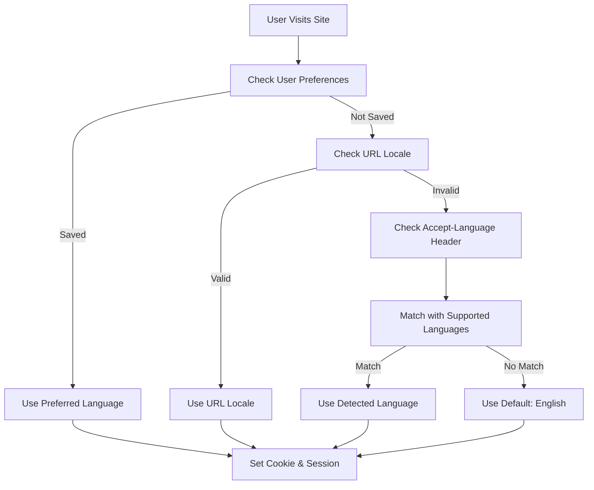
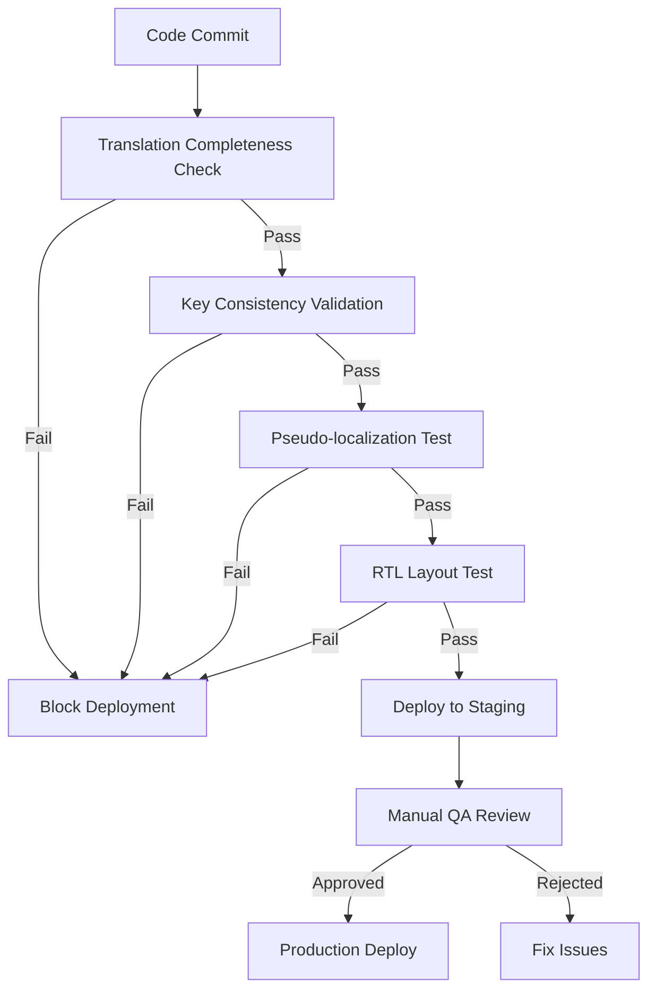
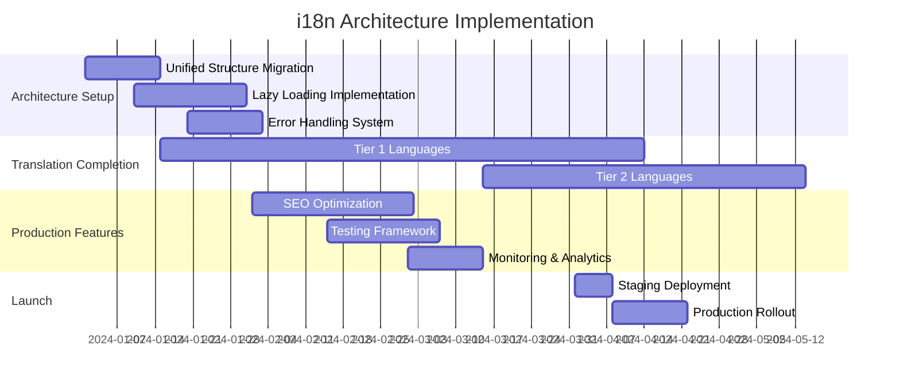

# BiteBase Intelligence - Comprehensive i18n Architecture & Strategy

## Executive Summary

This document outlines a comprehensive internationalization (i18n) architecture and strategy for the BiteBase Intelligence Next.js application. Based on detailed analysis of the current implementation, this design addresses critical gaps including incomplete translations, dual translation sources, missing lazy loading, and production readiness issues.

## Current State Analysis

### ✅ Strengths
- **Solid Foundation**: next-intl v4.3.6 with proper configuration
- **11 Language Support**: en, th, es, fr, de, it, pt, zh, ja, ko, ar
- **RTL Support**: Arabic language support implemented
- **Namespace Structure**: 18 translation namespaces defined
- **Dynamic Routing**: [locale] structure with middleware
- **Fallback System**: English fallback in i18n/request.ts

### ❌ Critical Issues Identified
1. **Translation Incompleteness**: 
   - Chinese (zh) has only English text in common.json
   - Chinese missing analytics.json entirely
   - Arabic missing most namespaces (only common.json, navigation.json)
   
2. **Dual Translation Sources**: 
   - `/frontend/src/messages/` (primary - used by next-intl)
   - `/frontend/public/locales/` (unused duplicate structure)
   
3. **No Lazy Loading**: All 18 namespaces loaded at once per request
4. **Production Readiness**: Limited error handling, no translation validation
5. **Maintenance Complexity**: Manual translation management without workflows

### Translation Completeness Matrix
```
Language | Namespaces Present | Completion Rate | Priority Level
---------|-------------------|----------------|---------------
en       | 12/18            | 67%            | Reference
th       | 11/18            | 61%            | Medium  
es       | 8/18             | 44%            | High
fr       | 4/18             | 22%            | High
de       | 4/18             | 22%            | High
it       | 4/18             | 22%            | Medium
pt       | 4/18             | 22%            | Medium
zh       | 4/18             | 22%            | High
ja       | 4/18             | 22%            | Medium
ko       | 4/18             | 22%            | Medium
ar       | 2/18             | 11%            | Medium
```

## 1. Unified Translation Source Architecture

### 1.1 Current Dual Structure Problem


### 1.2 Proposed Unified Structure
```
/frontend/src/i18n/
├── locales/                    # Single source of truth
│   ├── en/                     # Reference language (complete)
│   │   ├── common.json
│   │   ├── navigation.json
│   │   ├── auth.json
│   │   ├── dashboard.json
│   │   ├── analytics.json
│   │   ├── ai.json
│   │   ├── insights.json
│   │   ├── location.json
│   │   ├── reports.json
│   │   ├── restaurants.json
│   │   ├── errors.json
│   │   ├── landing.json
│   │   ├── landing-new.json
│   │   └── landing-old.json
│   ├── zh/                     # High priority - complete all
│   ├── es/                     # High priority - complete all
│   ├── fr/                     # High priority - complete all
│   ├── de/                     # High priority - complete all
│   ├── th/                     # Medium priority
│   ├── ar/                     # Medium priority + RTL
│   └── [other-languages]/
├── config.ts                   # Centralized i18n configuration
├── lazy-loader.ts             # Route-based namespace loader
├── validation.ts              # Translation completeness validator
├── fallback-handler.ts        # Production error handling
└── types.ts                   # TypeScript definitions
```

### 1.3 Migration Strategy
1. **Phase 1**: Create new unified structure under `/src/i18n/locales/`
2. **Phase 2**: Migrate existing translations with validation
3. **Phase 3**: Update import paths in request.ts
4. **Phase 4**: Remove old `/src/messages/` and `/public/locales/`
5. **Phase 5**: Implement validation CI/CD checks

## 2. Route-Based Lazy Loading Architecture

### 2.1 Namespace-Route Mapping
```typescript
const ROUTE_NAMESPACE_MAP = {
  '/dashboard': ['common', 'navigation', 'dashboard'],
  '/analytics': ['common', 'navigation', 'analytics'],
  '/ai-assistant': ['common', 'navigation', 'ai'],
  '/ai-center': ['common', 'navigation', 'ai'],
  '/restaurant-management': ['common', 'navigation', 'restaurants'],
  '/location-intelligence': ['common', 'navigation', 'location'],
  '/reports': ['common', 'navigation', 'reports'],
  '/auth/*': ['common', 'auth'],
  '/': ['common', 'navigation', 'landing'],
  // Global namespaces loaded on all routes
  'global': ['common', 'navigation', 'errors']
};
```

### 2.2 Lazy Loading Flow


### 2.3 Implementation Strategy
- **Bundle Splitting**: Separate chunks per namespace per language
- **Preloading**: Global namespaces (common, navigation, errors) loaded immediately
- **Route Guards**: Ensure translations loaded before route render
- **Caching**: In-memory cache with TTL for loaded namespaces
- **Error Handling**: Graceful degradation to English fallback

## 3. Translation Completion Strategy (High-Traffic Languages First)

### 3.1 Priority Framework
**Tier 1 (High Priority - Complete First)**:
- Chinese (zh) - High business impact
- Spanish (es) - Large user base  
- French (fr) - European market
- German (de) - European market

**Tier 2 (Medium Priority)**:
- Thai (th) - Regional importance
- Arabic (ar) - RTL complexity
- Italian (it), Portuguese (pt), Japanese (ja), Korean (ko)

### 3.2 Completion Roadmap


### 3.3 Namespace Priority Order
1. **Core**: common, navigation, auth, errors
2. **Features**: dashboard, analytics, restaurants
3. **Specialized**: ai, insights, location, reports
4. **Marketing**: landing, landing-new, landing-old

## 4. Comprehensive Error Handling & Fallback Mechanisms

### 4.1 Multi-Level Fallback Strategy


### 4.2 Error Types & Handling
```typescript
enum TranslationErrorType {
  NAMESPACE_MISSING = 'namespace_missing',
  KEY_MISSING = 'key_missing', 
  LOCALE_MISSING = 'locale_missing',
  NETWORK_ERROR = 'network_error',
  PARSE_ERROR = 'parse_error'
}
```

### 4.3 Production Error Monitoring
- **Error Tracking**: Log missing translations for improvement
- **Analytics**: Track fallback usage patterns
- **Alerts**: Critical namespace failures
- **Graceful UI**: Never show broken keys to users

## 5. Internal Team Translation Management Workflow

### 5.1 Workflow Architecture


### 5.2 Team Roles & Responsibilities
- **Developers**: Create English keys, manage namespace structure
- **Translation Leads**: Review translations, maintain quality standards
- **Language Specialists**: Translate and culturally adapt content
- **QA Team**: Validate translations in context

### 5.3 Translation Management Tools
```typescript
// CLI Tools for Translation Management
const translationCLI = {
  commands: {
    'extract': 'Extract new keys from codebase',
    'validate': 'Check translation completeness',
    'sync': 'Sync keys across all languages', 
    'audit': 'Generate translation status report',
    'import': 'Import translations from external tools',
    'export': 'Export for external translation'
  }
};
```

## 6. Enhanced RTL Support & Accessibility

### 6.1 RTL Language Configuration
```typescript
const RTL_LANGUAGES = ['ar', 'he', 'fa', 'ur'];
const LTR_LANGUAGES = ['en', 'es', 'fr', 'de', 'it', 'pt', 'zh', 'ja', 'ko', 'th'];

const getTextDirection = (locale: string): 'rtl' | 'ltr' => {
  return RTL_LANGUAGES.includes(locale) ? 'rtl' : 'ltr';
};
```

### 6.2 RTL Styling Strategy
- **CSS Logical Properties**: Use margin-inline-start instead of margin-left
- **Dynamic Classes**: Apply rtl/ltr classes based on locale
- **Icon Mirroring**: Flip directional icons for RTL languages
- **Layout Adaptation**: Flex-direction and positioning adjustments

### 6.3 Accessibility Enhancements
- **Screen Reader Support**: Proper lang attributes on elements
- **Keyboard Navigation**: RTL-aware focus management  
- **High Contrast**: Ensure readability in all languages
- **Font Optimization**: Language-specific font loading

## 7. Production-Ready Language Detection & User Preferences

### 7.1 Detection Priority Chain


### 7.2 User Preference System
```typescript
interface UserLanguagePreference {
  primary: string;           // User's selected language
  fallback: string;          // Secondary preference
  autoDetect: boolean;       // Enable automatic detection
  lastUpdated: timestamp;    // When preference was set
  source: 'user' | 'auto';   // How preference was determined
}
```

### 7.3 Smart Detection Features
- **Geographic Detection**: IP-based country suggestions
- **Browser Language**: Accept-Language header parsing
- **Persistence**: Cookie + localStorage + user account
- **A/B Testing**: Language recommendation experiments

## 8. SEO Optimization Strategy

### 8.1 Multilingual SEO Architecture
```typescript
// Hreflang Implementation
const generateHreflangTags = (currentLocale: string, pathname: string) => {
  return SUPPORTED_LOCALES.map(locale => ({
    rel: 'alternate',
    hreflang: locale === 'en' ? 'x-default' : locale,
    href: `${BASE_URL}/${locale}${pathname}`
  }));
};
```

### 8.2 Sitemap Generation Strategy
- **Per-Language Sitemaps**: Separate XML sitemaps per locale
- **Automated Generation**: Build-time sitemap creation
- **Priority Mapping**: Language-specific content priorities
- **Update Frequency**: Based on content change patterns

### 8.3 Meta Tag Optimization
```typescript
interface LocalizedMetadata {
  title: string;
  description: string;
  keywords: string[];
  ogTitle: string;
  ogDescription: string;
  twitterTitle: string;
  twitterDescription: string;
}
```

## 9. Testing & Quality Assurance Framework

### 9.1 Automated Testing Strategy


### 9.2 Test Categories
- **Unit Tests**: Translation key validation, fallback logic
- **Integration Tests**: Route-based loading, error handling
- **E2E Tests**: Complete user flows in each language  
- **Visual Tests**: Screenshot comparison for RTL/LTR
- **Performance Tests**: Bundle size, loading times per language

### 9.3 Quality Metrics
```typescript
interface TranslationQualityMetrics {
  completeness: number;      // % of keys translated
  consistency: number;       // Translation consistency score
  contextAccuracy: number;   // In-context validation score  
  loadTime: number;         // Average namespace load time
  errorRate: number;        // % of translation errors
}
```

## 10. Deployment & Maintenance Strategy

### 10.1 CI/CD Pipeline Integration
```yaml
# Translation Validation Steps
validation_steps:
  - translation_completeness_check
  - key_consistency_validation  
  - pseudo_localization_test
  - bundle_size_analysis
  - accessibility_audit
```

### 10.2 Rollback Strategy
- **Gradual Rollouts**: Deploy translations by percentage of users
- **Health Checks**: Monitor translation error rates
- **Automatic Rollback**: Revert if error thresholds exceeded
- **Manual Override**: Emergency translation disabling

### 10.3 Maintenance Schedule
- **Weekly**: Translation completeness reports
- **Monthly**: Quality metric analysis and optimization
- **Quarterly**: Full translation audit and cleanup
- **Annually**: Language priority reassessment

## Implementation Timeline



## Success Metrics

### Performance Targets
- **Bundle Size Reduction**: 40% decrease in initial translation bundle
- **Load Time**: <200ms for namespace loading
- **Translation Coverage**: 95%+ for Tier 1 languages
- **Error Rate**: <0.1% translation fallbacks in production

### Business Impact
- **User Experience**: Improved engagement in non-English markets
- **Market Expansion**: Enable launch in 4 high-priority markets
- **Maintenance Efficiency**: 50% reduction in translation management overhead
- **SEO Performance**: 30% improvement in organic traffic from international markets

## Conclusion

This comprehensive i18n architecture provides a scalable, maintainable, and performance-optimized foundation for BiteBase Intelligence's international expansion. The phased implementation approach minimizes risk while delivering immediate value through improved translation management and user experience.

The architecture addresses all identified critical issues while establishing robust processes for ongoing translation management, quality assurance, and performance optimization.