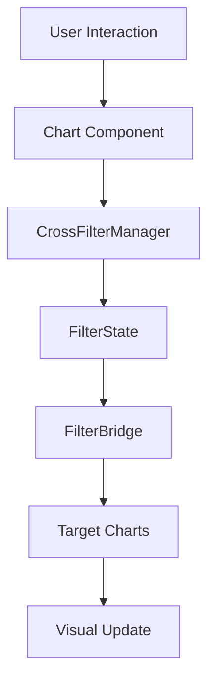

# BiteBase Intelligence 2.0 - Advanced Chart Library
## Technical Specifications & Architecture Documentation

### Overview
This document provides comprehensive technical specifications for the advanced chart library that extends Chart.js 4.5.0 with 22+ interactive chart types, cross-filtering capabilities, and performance optimizations for the BiteBase BI platform.

## Architecture Overview

### Component Hierarchy
```
ChartProvider (Context)
├── CrossFilterProvider (Context)
├── ThemeProvider (Context)
└── ChartContainer (Wrapper)
    └── BaseChart (Foundation)
        ├── Basic Charts (Chart.js Native)
        │   ├── LineChart
        │   ├── BarChart
        │   ├── PieChart
        │   └── ... (9 total)
        └── Advanced Charts (Extended/Custom)
            ├── TreeMapChart
            ├── SankeyChart
            ├── GanttChart
            └── ... (13 total)
```

### Core Components

#### 1. ChartProvider (`/providers/ChartProvider.tsx`)
**Purpose**: Main context provider for chart state management
**Key Features**:
- Chart instance registry and lifecycle management
- Global theme and performance configuration
- Cross-chart communication coordination

**API**:
```typescript
interface ChartProviderContextValue {
  state: ChartProviderState
  registerChart: (id: string, type: ChartType, chart: any) => void
  unregisterChart: (id: string) => void
  updateChart: (id: string, chart: any) => void
  setTheme: (theme: ThemeConfig) => void
  getChart: (id: string) => ChartInstance | undefined
}
```

#### 2. CrossFilterProvider (`/providers/CrossFilterProvider.tsx`)
**Purpose**: Manages cross-filtering between charts
**Key Features**:
- Automatic and manual filtering modes
- Filter state management and history
- Bidirectional filter propagation
- Filter bridges for data transformation

**API**:
```typescript
interface CrossFilterContextValue {
  applyFilter: (chartId: string, filter: FilterGroup) => void
  removeFilter: (chartId: string, filterId: string) => void
  clearFilters: (chartId?: string) => void
  toggleMode: () => void
  undo: () => void
  redo: () => void
}
```

#### 3. ThemeProvider (`/providers/ThemeProvider.tsx`)
**Purpose**: Manages chart theming and styling
**Key Features**:
- BiteBase dark theme integration
- Responsive theme adjustments
- CSS variable generation
- Theme persistence

**API**:
```typescript
interface ThemeContextValue {
  theme: ThemeConfig
  setTheme: (theme: ThemeConfig) => void
  toggleMode: () => void
  getChartColors: (count: number) => string[]
  getCSSVariables: () => Record<string, string>
}
```

#### 4. BaseChart (`/core/BaseChart.tsx`)
**Purpose**: Foundation component for all chart types
**Key Features**:
- Dynamic chart module loading
- Performance optimization
- Accessibility compliance
- Event handling and cross-filtering integration

**Props**:
```typescript
interface BaseChartProps {
  id: string
  type: ChartType
  data: ChartData
  options?: ChartOptions
  dimensions?: ChartDimensions
  theme?: Partial<ChartTheme>
  performance?: Partial<ChartPerformanceConfig>
  accessibility?: Partial<ChartAccessibilityConfig>
  onChartReady?: (chart: ChartJS) => void
  onDataClick?: (event: any, elements: any[]) => void
}
```

#### 5. ChartContainer (`/core/ChartContainer.tsx`)
**Purpose**: Wrapper component with UI controls and functionality
**Key Features**:
- Fullscreen mode
- Export functionality
- Filter controls
- Loading and error states
- Header and footer customization

#### 6. ChartRegistry (`/core/ChartRegistry.ts`)
**Purpose**: Manages chart type registration and dynamic loading
**Key Features**:
- Lazy loading of chart modules
- Performance-based loading priorities
- Dependency management
- Module caching

## Supported Chart Types

### Basic Charts (Chart.js Native)
1. **LineChart** - Time series and trend visualization
2. **BarChart** - Categorical data comparison
3. **PieChart** - Part-to-whole relationships
4. **DoughnutChart** - Pie chart variant with center space
5. **AreaChart** - Filled line charts
6. **ScatterChart** - Correlation visualization
7. **BubbleChart** - Three-dimensional data points
8. **RadarChart** - Multi-dimensional data comparison
9. **PolarAreaChart** - Circular area chart

### Advanced Charts (Extended/Custom)
10. **TreeMapChart** - Hierarchical data visualization
11. **SankeyChart** - Flow and process visualization
12. **GanttChart** - Project timeline management
13. **HeatmapChart** - Matrix data visualization
14. **NetworkGraph** - Relationship and network data
15. **FunnelChart** - Process flow visualization
16. **WaterfallChart** - Cumulative value changes
17. **BoxPlotChart** - Statistical distribution
18. **ViolinPlotChart** - Distribution density
19. **SunburstChart** - Hierarchical pie chart
20. **ChordDiagram** - Relationship matrix
21. **TimelineChart** - Event chronology
22. **CandlestickChart** - Financial OHLC data

## Cross-Filtering Architecture

### Filter Data Flow


### Filter Types
```typescript
type FilterOperation = 
  | 'equals' | 'not_equals' | 'greater_than' | 'less_than' 
  | 'contains' | 'in' | 'between' | 'is_null'

interface FilterCondition {
  id: string
  field: string
  operation: FilterOperation
  value: FilterValue
  dataType: 'string' | 'number' | 'boolean' | 'date'
}
```

### Filtering Modes
- **Automatic Mode**: Instant filter application on chart interaction
- **Manual Mode**: User-controlled filter application
- **Bidirectional**: Filters propagate in both directions
- **Unidirectional**: One-way filter propagation

## Performance Optimization

### Loading Strategy
1. **Lazy Loading**: Chart modules loaded on-demand
2. **Code Splitting**: Separate bundles for basic vs advanced charts
3. **Preloading**: Priority-based module preloading
4. **Caching**: Module and data caching strategies

### Rendering Optimization
1. **Virtualization**: Large dataset handling
2. **WebGL**: Hardware acceleration for complex charts
3. **Animation Control**: Performance-based animation adjustment
4. **Memory Management**: Automatic cleanup and garbage collection

### Performance Targets
- **Dashboard Load Time**: < 2 seconds
- **Chart Render Time**: < 500ms for basic, < 1s for advanced
- **Memory Usage**: < 100MB for 20+ charts
- **Filter Response Time**: < 100ms

## Mobile Responsiveness

### Breakpoint Strategy
```typescript
const breakpoints = {
  sm: 640,   // Mobile
  md: 768,   // Tablet
  lg: 1024,  // Desktop
  xl: 1280,  // Large Desktop
  '2xl': 1536 // Extra Large
}
```

### Responsive Features
- **Adaptive Layouts**: Chart sizing based on screen size
- **Touch Interactions**: Mobile-optimized chart interactions
- **Simplified UI**: Reduced controls on mobile devices
- **Performance Scaling**: Lower complexity on mobile

## Accessibility Compliance (WCAG 2.1 AA)

### Features
1. **Keyboard Navigation**: Full keyboard accessibility
2. **Screen Reader Support**: ARIA labels and descriptions
3. **Color Blind Friendly**: Alternative color schemes
4. **High Contrast**: Enhanced visibility options
5. **Focus Management**: Proper focus indicators

### Implementation
```typescript
interface ChartAccessibilityConfig {
  enableKeyboardNavigation: boolean
  enableScreenReader: boolean
  ariaLabel?: string
  ariaDescription?: string
  colorBlindFriendly: boolean
  highContrast: boolean
}
```

## Real-Time Data Updates

### Architecture
```typescript
interface ChartRealTimeConfig {
  enabled: boolean
  updateInterval: number
  maxDataPoints: number
  smoothTransitions: boolean
  bufferSize: number
}
```

### Features
- **Streaming Data**: WebSocket integration
- **Buffer Management**: Efficient data buffering
- **Smooth Transitions**: Animated data updates
- **Performance Scaling**: Adaptive update rates


### Widget Integration
```typescript
interface DashboardWidget {
  id: string
  type: 'chart'
  chartType: ChartType
  size: 'small' | 'medium' | 'large' | 'full'
  position: { x: number; y: number }
  visible: boolean
  data: any
}
```

### Dashboard Features
- **Drag & Drop**: Chart repositioning
- **Resize Handles**: Dynamic chart sizing
- **Widget Controls**: Show/hide, fullscreen, export
- **Layout Persistence**: Save dashboard configurations

## Theme System

### BiteBase Theme Configuration
```typescript
const bitebaseTheme = {
  name: 'BiteBase Dark',
  mode: 'dark',
  colors: {
    primary: ['#22c55e', '#16a34a', '#15803d'],
    secondary: ['#3b82f6', '#2563eb', '#1d4ed8'],
    accent: ['#00ff88', '#10b981', '#059669']
  },
  charts: {
    background: { primary: '#0f172a', secondary: '#1e293b' },
    foreground: { primary: '#f8fafc', secondary: '#cbd5e1' },
    grid: { primary: '#334155', secondary: '#475569' }
  }
}
```

## API Reference

### Main Exports
```typescript
// Components
export { ChartProvider, CrossFilterProvider, ThemeProvider }
export { BaseChart, ChartContainer, ChartRegistry }
export { LineChart, BarChart, TreeMapChart, SankeyChart /* ... */ }

// Hooks
export { useChart, useCrossFilter, useChartTheme }

// Types
export type { ChartType, BaseChartProps, FilterGroup }

// Utils
export { chartHelpers, dataTransformers, performanceUtils }
```

### Usage Example
```typescript
import { ChartProvider, LineChart } from '@/components/charts'

function Dashboard() {
  return (
    <ChartProvider>
      <LineChart
        id="sales-trend"
        data={salesData}
        options={{ responsive: true }}
        onDataClick={handleDataClick}
      />
    </ChartProvider>
  )
}
```

## Dependencies

### Required Dependencies
```json
{
  "chart.js": "^4.5.0",
  "react-chartjs-2": "^5.3.0",
  "chartjs-chart-treemap": "^2.3.0",
  "chartjs-chart-sankey": "^0.12.0",
  "chartjs-adapter-date-fns": "^3.0.0",
  "d3": "^7.8.5"
}
```

### Optional Dependencies (Lazy Loaded)
- `chartjs-chart-matrix` - Heatmap charts
- `chartjs-chart-funnel` - Funnel charts
- `chartjs-chart-waterfall` - Waterfall charts
- `chartjs-chart-box-and-violin-plot` - Statistical charts
- `chartjs-chart-financial` - Financial charts

## File Structure
```
frontend/src/components/charts/
├── index.ts                     # Main exports
├── providers/                   # Context providers
│   ├── ChartProvider.tsx
│   ├── CrossFilterProvider.tsx
│   └── ThemeProvider.tsx
├── core/                        # Core components
│   ├── BaseChart.tsx
│   ├── ChartContainer.tsx
│   └── ChartRegistry.ts
├── basic/                       # Basic Chart.js charts
│   ├── LineChart.tsx
│   ├── BarChart.tsx
│   └── ...
├── advanced/                    # Advanced/custom charts
│   ├── TreeMapChart.tsx
│   ├── SankeyChart.tsx
│   └── ...
├── filtering/                   # Cross-filtering logic
│   ├── CrossFilterManager.ts
│   └── FilterBridge.tsx
├── hooks/                       # React hooks
│   ├── useChart.ts
│   ├── useCrossFilter.ts
│   └── useChartTheme.ts
├── utils/                       # Utility functions
│   ├── chartHelpers.ts
│   ├── dataTransformers.ts
│   └── performanceUtils.ts
├── types/                       # TypeScript definitions
│   ├── chartTypes.ts
│   ├── filterTypes.ts
│   └── themeTypes.ts
└── TECHNICAL_SPECIFICATIONS.md  # This document
```

## Testing Strategy

### Unit Tests
- Component rendering and props
- Hook functionality
- Utility functions
- Type definitions

### Integration Tests
- Provider interactions
- Cross-filtering behavior
- Theme application
- Performance benchmarks

### E2E Tests
- Dashboard interactions
- Chart responsiveness
- Export functionality
- Accessibility compliance

## Deployment Considerations

### Bundle Optimization
- Tree shaking for unused chart types
- Code splitting by chart complexity
- Dynamic imports for advanced features
- CDN delivery for Chart.js dependencies

### Performance Monitoring
- Chart render time tracking
- Memory usage monitoring
- User interaction analytics
- Error boundary implementation

---

**Version**: 1.0.0  
**Last Updated**: 2025-01-27  
**Maintainer**: BiteBase Intelligence Team